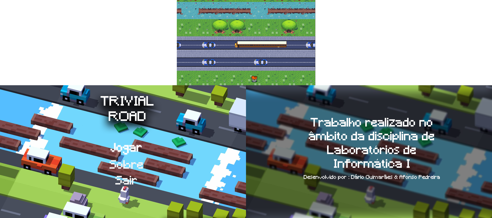

<!-- PROJECT LOGO -->
<br />
<div align="center">
  <a href="https://github.com/darguima/Trivial-Road-LI1">
    
  </a>

  <h3 align="center">Trivial-Road LI1</h3>

  <p align="center">
    A fantastic copy of Crossy Road developed in Haskell
    <br />
    <br />
    <a href="#-demo">View Demo</a>
    &middot;
    <a href="#️-download--installation">Download Project</a>
    &middot;
    <a href="#-getting-started-with-development">Start Developing</a>
  </p>

<h4 align="center">
⭐ Don't forget to Starring ⭐
</h4>

  <div align="center">

[![Haskell][Haskell-badge]][Haskell-url]
[![Gloss][Gloss-badge]][Gloss-url]

  </div>

  <div align="center">

![University][university-badge]
![Subject][subject-badge]
![Grade][grade-badge]

  </div>
</div>


<!-- TABLE OF CONTENTS -->
<details>
  <summary>📋 Table of Contents</summary>

## 📋 Table of Contents

- [About The Project](#-about-the-project)
- [Download & Installation](#️-download--installation)
- [Usage](#-usage)
- [Getting Started with Development](#-getting-started-with-development)
- [Contributing](#-contributing)
- [Developed by](#-developed-by)
</details>


## 🔍 About The Project

### 🎯 The goal

The goal was develop a clone of Crossy Road game with Gloss library from Haskell.

### ⚙️ How it works?

Trying to bring our past coding knowledge to the project, we tried at maximum modularize the code, and make it as clean as possible. We also tried to use the best practices of the functional programming paradigm.

### 🎬 Demo



https://user-images.githubusercontent.com/49988070/210379668-3602bce1-2cd6-43e8-901b-61e537cb54d5.mp4

### GamePad 🎮

The game is compatible with gamepads.

###### I'm lying, just remap the gamepad with [`qjoypad`](https://github.com/panzi/qjoypad)

https://user-images.githubusercontent.com/49988070/211230247-414fadf8-816c-45dc-8da8-826a0fe67c37.mp4


### 🧩 Features

* Smooth Gameplay
* Bot
* There are no impossible paths in the grass paths (there is always a passage between the trees)
* Scoring System, which notifies when the maximum score has been achieved


## ⬇️ Download & Installation

You can download the game on [project's releases](https://github.com/Darguima/Trivial-Road-LI1/releases).


## 📖 Usage

* **Arrows** - Move the player
* **Space** - Advances the map without moving the player
* **Esc** - Enter Pause mode
* **Enter / Space** - Select options within the Menus


## 🚀 Getting Started with Development

To get a local copy up and running follow these simple example steps.

### 1. Prerequisites

Start by installing the following tools:

* [Git](https://git-scm.com/downloads) - Version Control System
* [GHC](https://www.haskell.org/ghc/) - Glasgow Haskell Compiler
* [Cabal](https://www.haskell.org/cabal/) - Haskell Build Tool

### 2. Cloning

Start by cloning the repository to your local machine. You can do this using Git:

```bash
$ git clone https://github.com/darguima/Trivial-Road-LI1.git
# or
$ git clone git@github.com:darguima/Trivial-Road-LI1.git
```

### 3. Dependencies

Install the dependencies using `cabal`:

```bash
$ cabal update
$ cabal install --only-dependencies
```

### 4. Interpreter

You can open the Haskell interpreter (GHCi) using cabal or directly in the interpreter.

1. With `cabal`

```bash
$ cabal repl
>>> main
```

2. With GHCi (on root folder of the project)

```bash
$ ghci -i="src" -i="tests" src/Main.hs
>>> main
```

### 5. Building

To compile the code you can use `cabal`:

```bash
$ mkdir TrivialRoad -p
$ rm -r ./dist-newstyle/build &> /dev/null
$ cabal build
$ mv ./src/Main ./TrivialRoad/trivialRoad
$ cp ./assets ./TrivialRoad -r
$ cp ./highscore.txt ./TrivialRoad

# Single Command
$ mkdir TrivialRoad -p; rm -r ./dist-newstyle/build &> /dev/null; cabal build; mv ./src/Main ./TrivialRoad/trivialRoad; cp ./assets ./TrivialRoad -r; cp ./highscore.txt ./TrivialRoad
```

It will generate a `TrivialRoad` folder that contains all the necessary files for the game to run.

```bash
# Linux
$ ./TrivialRoad/trivialRoad
```

Now you can compress the folder and send it anywhere, without the need to have Haskell on other computers.

### 6. Tests

This project uses the [HUnit](https://hackage.haskell.org/package/HUnit) library to run unit tests.

You can run the tests using one of the following alternatives:

1. With `cabal`

```bash
$ cabal test
```

2. With GHCi

```bash
$ ghci -i="src" -i="tests" tests/Spec.hs
>>> runTestsT1 -- Correr os testes tarefa 1
>>> runTestsT2 -- Correr os testes tarefa 2
>>> runTestsT3 -- Correr os testes tarefa 3
>>> runTestsT4 -- Correr os testes tarefa 4
>>> main -- Correr todos os testes
```

3. With the wrapper `runhaskell`

```bash
$ runhaskell -i="src" -i="tests" tests/Spec.hs
```

### 7. Docs

You can generate the documentation with [Haddock](https://haskell-haddock.readthedocs.io/).

1. With `cabal`

```bash
$ cabal haddock --haddock-all
```

2. With `haddock`

```bash
$ haddock -h -o doc/html src/*.hs
```


## 🤝 Contributing

Contributions are what make the open source community such an amazing place to learn, inspire, and create. Any contributions you make are **greatly appreciated**.

If you have a suggestion that would make this better, please fork the repo and create a pull request. You can also simply open an issue with the tag "enhancement".
Don't forget to give the project a star! Thanks again!

1. Fork the Project
2. Create your Feature Branch (`git checkout -b feature/AmazingFeature`)
3. Commit your Changes (`git commit -m 'Add some AmazingFeature'`)
4. Push to the Branch (`git push origin feature/AmazingFeature`)
5. Open a Pull Request


## 👨‍💻 Developed by

- [Afonso Pedreira](https://github.com/afooonso)
- [Dário Guimarães](https://github.com/darguima)


<!-- MARKDOWN LINKS & IMAGES -->
<!-- https://www.markdownguide.org/basic-syntax/#reference-style-links -->
[project-thumbnail]: ./readme/logo.png

[university-badge]: https://img.shields.io/badge/University-Universidade%20do%20Minho-red?style=for-the-badge
[subject-badge]: https://img.shields.io/badge/Subject-LI1-blue?style=for-the-badge
[grade-badge]: https://img.shields.io/badge/Grade-19%2F20-brightgreen?style=for-the-badge

[Haskell-badge]: https://img.shields.io/badge/Haskell-5e5086?style=for-the-badge&logo=haskell&logoColor=white
[Haskell-url]: https://www.haskell.org

[Gloss-badge]: https://img.shields.io/badge/Gloss-cc3333?style=for-the-badge&logoColor=white
[Gloss-url]: http://hackage.haskell.org/package/gloss
